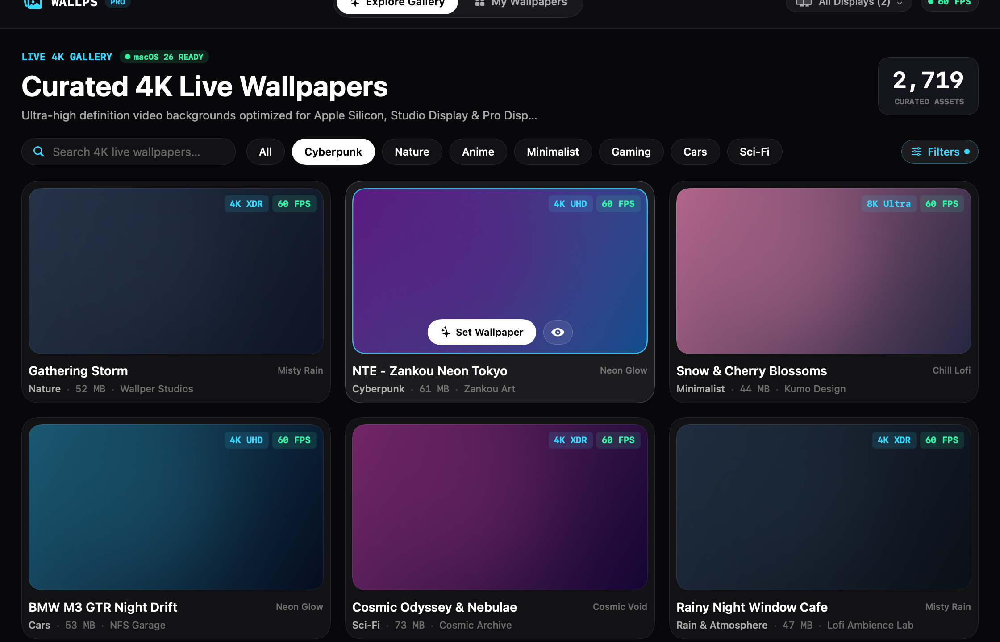
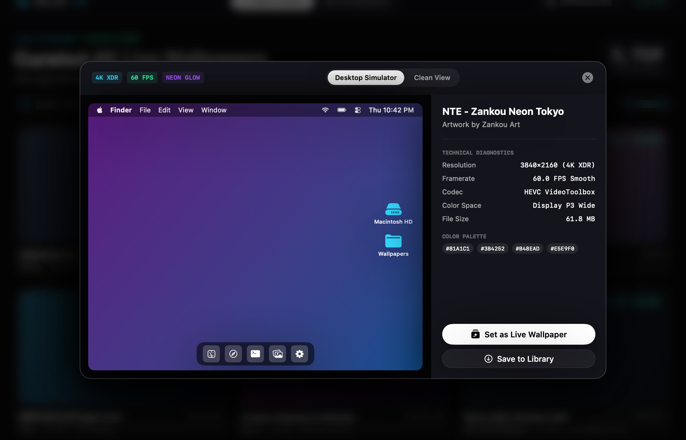
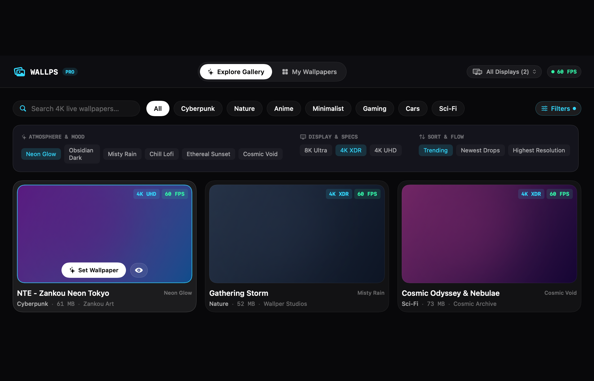
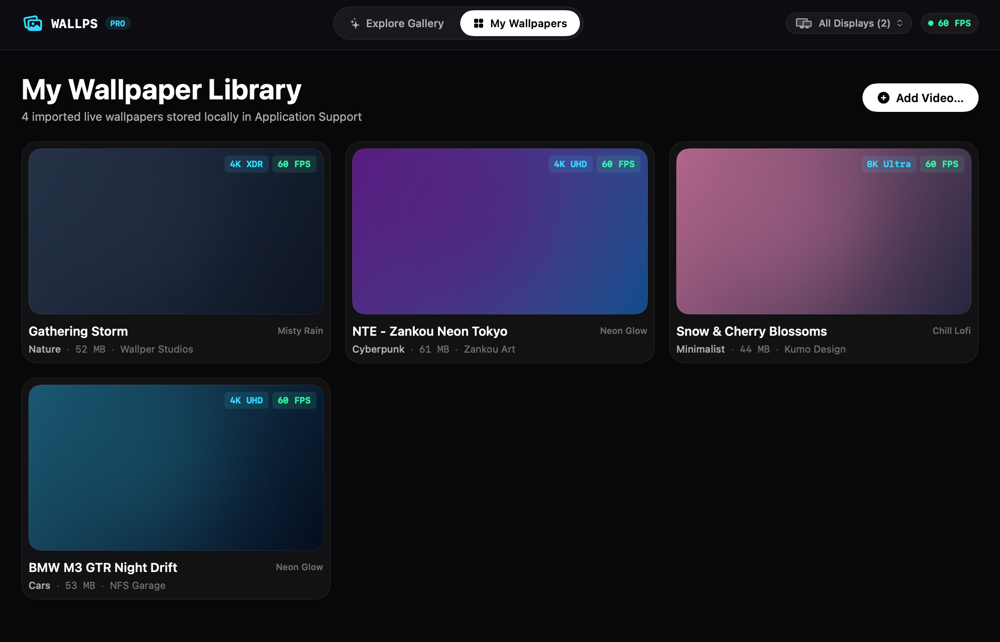

# Wallps

<div align="center">



**Ultra-Minimal 4K Live Video Wallpapers for macOS.**  
*Native, hardware-accelerated, battery-aware, and 100% telemetry-free.*

[](https://github.com/Srimi1/Wallps/releases)
[](https://github.com/Srimi1/Wallps/releases)
[](LICENSE)
[](SECURITY.md)
[](https://github.com/Srimi1/Wallps/releases)

[**Download Latest DMG**](https://github.com/Srimi1/Wallps/releases) • [**Explore Features**](#-key-features) • [**Security & Privacy**](#-security--privacy) • [**Architecture**](#-how-it-works) • [**Build from Source**](#-install--build)

</div>

---

## ✨ Overview

**Wallps** is an open-source live wallpaper engine built natively for macOS with SwiftUI and AVFoundation. It seamlessly renders smooth 4K/8K looping videos behind your desktop icons with minimal CPU & GPU footprint, and gets out of the way instantly when covered by windows or on battery power.

Inspired by modern futuristic minimalism, Wallps combines an **iOS 26 Multi-Dimensional Classification Matrix**, signature **beam-glow borders**, and an interactive **macOS Desktop Simulator**.

---

## 📸 Interface & Layout Showcase

### 1. Curated 4K Live Gallery
Explore thousands of high-definition video wallpapers with real-time hardware decoding, tech badges, and one-click desktop application.


---

### 2. Wallpaper Cinema & Desktop Simulator HUD
Preview how any live wallpaper looks beneath your actual macOS Top Menu Bar, Bottom Dock, and Desktop icons on Studio Display or MacBook screens before applying.



---

### 3. iOS 26 Multi-Dimensional Classification Matrix
Filter dynamically across **Atmosphere & Mood** (*Neon Glow, Obsidian Dark, Misty Rain, Chill Lofi, Ethereal Sunset, Cosmic Void*), **Display Specs** (*8K, 4K XDR, 4K UHD*), and **Sort Ordering**.



---

### 4. Local Video Library & Multi-Display Management
Drag and drop your own personal H.264/HEVC/ProRes clips into the library. Assign unique wallpapers per monitor or apply one across all connected displays.



---

## ⚡ Key Features

- **Obsidian Dark & Beam-Glow Design**: Ultra-minimal aesthetics with laser-cut beam borders (`BeamBorder`), frosted glass, and refined typography.
- **Hardware-Accelerated Decoding**: Leverages Apple Silicon Media Engine (`VideoToolbox` & `AVFoundation`) for fluid 60 FPS playback at negligible CPU cost.
- **Intelligent Battery & Occlusion Awareness**: Automatically stops decoding video when windows cover the desktop, on battery power, in Low Power Mode, or when displays sleep.
- **iOS 26 Multi-Dimensional Classification**: Smart filtering across categories (*Cyberpunk, Nature, Anime, Minimalist, Cars, Sci-Fi, Rain*), atmosphere moods, and display resolutions.
- **Live Desktop & Lock Screen Simulator**: Built-in simulator HUD to test visual harmony with macOS system UI.
- **Multi-Monitor Support**: Independent per-screen video wallpaper assignment or synchronized playback across all screens.
- **Zero Telemetry & 100% Private**: No analytics, no accounts, no background tracking.

---

## 🔋 How It Works: Battery-Aware Engine

macOS has no public API for "set video as wallpaper", so Wallps positions a borderless, click-through `NSWindow` at `CGWindowLevelForKey(.desktopWindow)`:

```
level -2147483624   system wallpaper (the Dock draws this)
level -2147483623   ← Wallps renders here
level -2147483622   Dock fullscreen backdrop
level -2147483603   desktop icons
level 0             your apps
```

### Power Management Policy

| Condition | Detected via | Default Action |
|---|---|---|
| Covered by a window | `NSWindow` occlusion state **and** a 2s `CGWindowListCopyWindowInfo` poll | **Pause** |
| Screen locked / Screensaver | `DistributedNotificationCenter` (`.deliverImmediately`) | **Always Pause** |
| Displays asleep | `NSWorkspace.screensDidSleep` + `CGDisplayIsAsleep` backstop | **Always Pause** |
| On battery power | IOKit power source notifications | **Pause** |
| Low Power Mode | `ProcessInfo.isLowPowerModeEnabled` | **Pause** |

---

## 🚀 Download & Installation

### Option 1: Download Pre-built DMG (Recommended)
Download the latest `.dmg` release from [Releases](https://github.com/Srimi1/Wallps/releases). Mount the disk image and drag **Wallps.app** to your `/Applications` folder.

### Option 2: Build from Source

**Requirements:**
- macOS 14.0 (Sonoma) or later (fully verified on macOS 26)
- Xcode 16.0+
- Apple Silicon or Intel Mac

```sh
# Clone repository
git clone https://github.com/Srimi1/Wallps.git
cd Wallps

# Bootstrap & generate Xcode project
make bootstrap

# Build and run the app
make run

# Build the release DMG installer
make dmg
```

The resulting DMG installer is output to `build/Wallps.dmg`.

---

## 🔒 Security & Privacy

Wallps is engineered from the ground up to respect user privacy and system security:
- **No Screen Recording / Accessibility Permissions**: Does not capture screen pixels or intercept user keystrokes/clicks.
- **Local Media Storage**: All imported videos stay in `~/Library/Application Support/Wallps/`.
- **Apple Hardened Runtime**: Protected against code injection and memory exploits.

For full details, please review our [Security Policy](SECURITY.md).

---

## 🛠️ Architecture

```
Wallps/
  App/        AppState (root coordinator), WallpsApp (scenes), AppDelegate
  Engine/     WallpaperEngine (per-display screen controller)
              WallpaperWindow (desktop-level NSWindow + AVPlayerLayer)
              PlaybackPolicy (pure logic), PowerMonitor, SystemStateMonitor, OcclusionDetector
  Library/    WallpaperLibrary (local index & files), CatalogStore (remote/curated),
              VideoProber, ThumbnailGenerator
  UI/         DesignSystem (beam glow tokens), ClassificationBar (iOS 26 matrix),
              WallpaperInspectorView (desktop simulator), GalleryView, LibraryWindow, MenuBarContent
  Support/    Preferences, WallpsError
```

---

## 🤝 Contributing

Contributions are welcome! Please read [CONTRIBUTING.md](CONTRIBUTING.md) and our [Code of Conduct](CODE_OF_CONDUCT.md) before submitting pull requests.

---

## 📄 License

Wallps is licensed under the [Apache-2.0 License](LICENSE).

